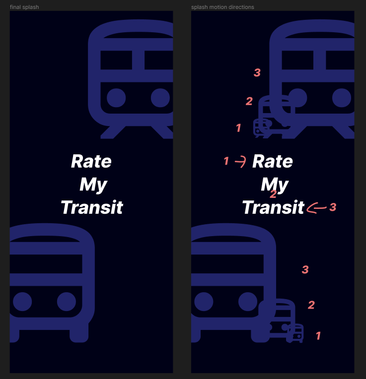
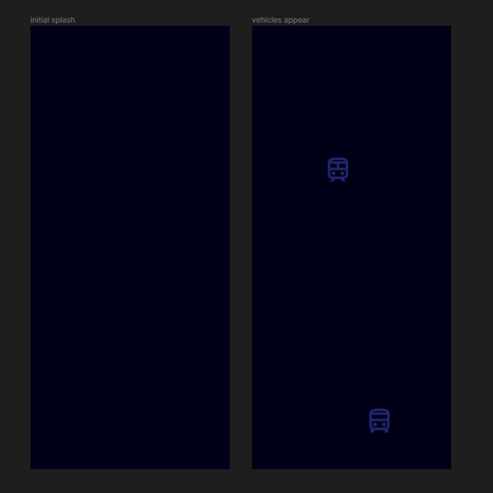
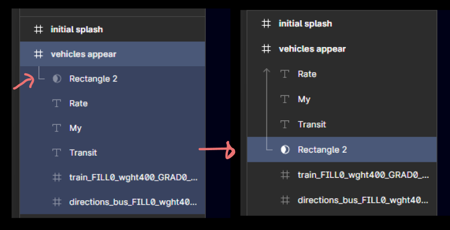
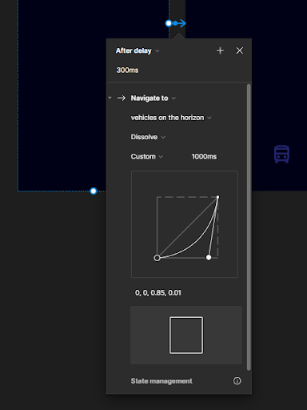
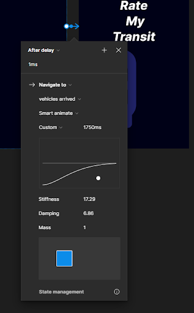
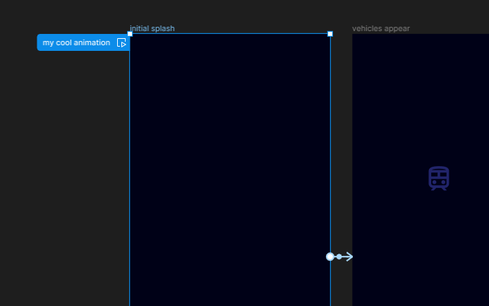

# Animate your first splash screen in Figma
{: .no_toc }

An animated splash screen can really bring your website or app to life. It’s accessible, enjoyable, and memorable for your users. In this demo, you'll learn how to build this animated splash screen for a mobile app called Rate my Transit.

<video width="800" controls>
  <source src="./splash_animation.mp4" type="video/mp4">
  Your browser does not support the video tag.
</video>

  

    Table of contents
  

  {: .text-delta }
1. TOC
{:toc}

---

# Gather the components you’ll be using in your app
Go to the [Google Material UI design library](https://fonts.google.com/icons) and search for `directions bus` and `train`. Download your icons in the `SVG` format.

{: .note }
There are thousands of icons you can explore in the Google design suite. There are also [many other design systems](https://www.designsystemsforfigma.com/) that are free to use on Figma!

# Build your final frame
This is how you want your splash screen to look once the animation completes. You will be building toward this state in the following tutorials.
1. Open Figma and create a new project.
2. Press `F` to open the Frame selection and choose `Android Large` on the right side panel.
2. Name this Frame `final splash`.
3. Drag and drop your two transit icons into your project
4. Select the Frame and change the `Fill` to `000117`, a dark blue color. This will be your background.
5. Select the transit icons and change the color under `Selection Colors` to `21246A`. Set the height and width of the icons to 333.
6. Press `T` to create text, and type `Rate`.
7. Repeat step 6 but with `My` and `Transit`. It is important to have these three words as separate Text objects because you will be animating them separately later. Set the text color to white, or `FFFFFF`.

{: .note-title }
> Optional
>
> It can be helpful to plan out what you want your animations to do! In the `splash motion directions` artboard on the right, the numbers indicate a rough idea of what the final animation in this tutorial will do.

# Build your transitional frames
1. We want our animation to start with a blank screen. To do this, press `F` to make a new Frame. Set the `Fill` to `000117`. Name this Frame `initial splash`.
2. Now we want two small vehicle icons that appear on the screen and get larger. Select the `initial splash` Frame you just created and press `ctrl-D`. Name this Frame `vehicles appear`. Drag and drop the two transit icons into this new Frame. Position them in the bottom left and top right and set their height and width to 55.

3. We also want the text `Rate My Transit` to slide into the final frame. Start by selecting the three text objects you created in [Build your final frame](./figma_animation.md#build-your-final-frame). Copy and paste them into the `vehicles appear` Frame. Center the text.
4. To achieve the slide-in effect, we will use the `Mask` functionality to hide the initial position of the text so it can be revealed in our animation. Click the rectangle icon in the top left (or press `R`) and draw a rectangle over your text in `vehicles appear`. Center the rectangle. Set the `Fill` of the rectangle to match the Frame's background color. Right click the rectangle and click `Use as Mask`.

<video width="800" controls>
  <source src="./create_mask.mp4" type="video/mp4">
  Your browser does not support the video tag.
</video>

{: .important-title }
> Important
>
> After you create your Mask, a line will appear on the left hand panel indicating which objects are included in your Mask. Select your text objects and drag them into the Mask section. The line should cover your three text objects.

5. Now that you've created the Mask containing your text objects, select each one and use the arrow keys to drag them outside the edges of the Mask. This will hide them in the initial part of the animation. Let's try having "Rate" start from the left, "My" start below, and "Transit" start from the right.

<video width="800" controls>
  <source src="./hide_text_in_mask.mp4" type="video/mp4">
  Your browser does not support the video tag.
</video>

6. Select your `vehicles appear` Frame and duplicate it again with `ctrl-D`. Name this new frame `vehicles arrive`. This will be your final frame. In `vehicles arrive`, set the width and height of the transit icons to 333. Drag the large icons slightly to the two sides of your frame. Select the three text objects in the mask and drag each one back into the center.

<video width="800" controls>
  <source src="./create_last_artboard.mp4" type="video/mp4">
  Your browser does not support the video tag.
</video>

# Animate your frames
Nice work! Now you're ready to start animating your frames.
1. In the upper right corner, click on `Prototype`.
2. Hover your mouse over your Frame named `initial splash`. A small, blue plus symbol in a circle should appear. Click and drag the plus symbol over to the next Frame, `vehicles appear`. This will create a Prototype connection indicated by a blue arrow.

<video width="800" controls>
  <source src="./create_prototype_connection.mp4" type="video/mp4">
  Your browser does not support the video tag.
</video>

3. In the dialog, set it to `After Delay` with a duration of 300ms. Select `Navigate to`, `Dissolve`, and `Custom bezier` with a duration of 1000ms for the animation style. You can edit this dialog at any time by clicking `Prototype` and clicking on the blue arrow.

4. Create another Prototype connection from `vehicles appear` to `vehicles arrive`. In the dialog, set it to `After delay` with a duration of 1ms, `Navigate to`, `Smart Animate`, and `Custom Spring` (1750ms).

5. Now that you've created your Prototype flow, give it a descriptive name, such as `my cool animation` by double clicking on the blue box next to your `initial splash` frame.

# Test your prototype
Nice work! Now you’re ready to test your animation.
1. Hover over your first frame in Prototype mode and click the Play icon on the right of the flow. A dialog box will open and play your animation. To repeat the animation, press `R`.

2. Make any adjustments to your animation as you see fit.

# Gather feedback
Now that your animation behaves as you intended, it's time to iterate on feedback from your teammates and peers.
1. In the upper right corner, click the Play icon.
2. In Prototype mode, click `Share prototype` in the upper right. In the options, share it with specific emails or click `anyone with the link`. Set the visibility to `view only` so people don't edit your project on accident.
3. UI/UX design is a collaborative process. Keep a log of the feedback from others. What would you change or add?

{: .note-title }
> Note
>
> Creating multiple versions of your animation can help you and your peers decide which one to bring into the final project.

# Iterate on feedback and add finishing touches

1. Review the feedback from your peers. Here is some sample feedback you might receive.
> Peer 1: The word "My" slides in from below the screen. That doesn't match the other text which comes in from the side. Would it be a good idea to have "My" also come in from the left or right side?

You can apply Peer 1's feedback and change the animation so the text slides in horizontally.

<video width="800" controls>
  <source src="./getting_rid_of_vertical.mp4" type="video/mp4">
  Your browser does not support the video tag.
</video>

> Peer 2: Would it be better to swap the directions of "My" and "Transit"? That way it looks more symmetrical with the word "Rate". Things look a bit odd with "Rate my" sliding in from the left and "transit" from the right.

2. Based on the feedback your peers provided, decide on a final version of the animation. All of the peers agreed that the vertical motion for the word "My" should be changed to slide in from the side instead. After seeing your update, one peer thinks it would look more symmetrical for "transit" to slide in from the left and "my" to slide in from the right. From their advice, let's swap the directions of "My" and "Transit" for a more symmetrical look.

<video width="800" controls>
  <source src="./arriving_at_final_version.mp4" type="video/mp4">
  Your browser does not support the video tag.
</video>

We have now arrived at our final version of the animation. Nice work!