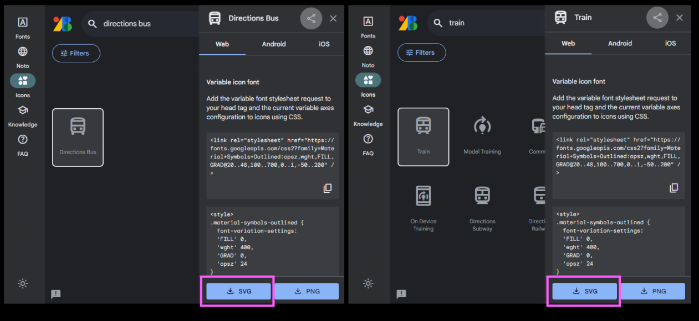

# Animate your first splash screen in Figma
{: .no_toc }

An animated splash screen can really bring your website or app to life. It’s accessible, enjoyable, and memorable for your users. In this demo, you'll learn how to build this animated splash screen for a mobile app called Rate my Transit.

<video width="800" controls>
  <source src="./splash_animation.mp4" type="video/mp4">
  Your browser does not support the video tag.
</video>

  

    Table of contents
  

  {: .text-delta }
1. TOC
{:toc}

---

# First, gather the components you’ll be using in your app.
You can find thousands of icons from the [Google Material UI design library](https://fonts.google.com/icons). There are also many other design suites you can use! Download your icons in the `SVG` format.

# Next, build your frames in Figma.
