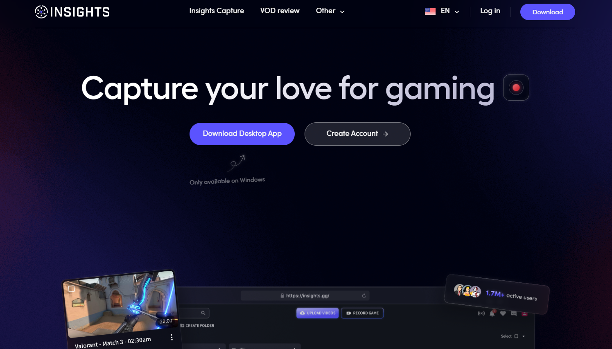
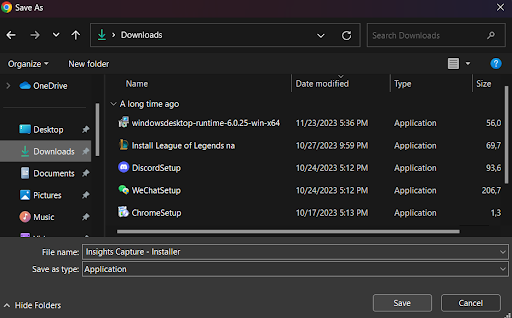
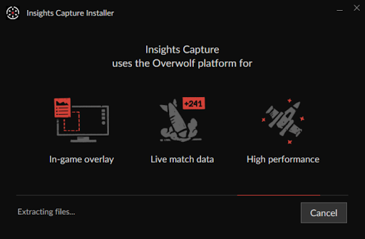
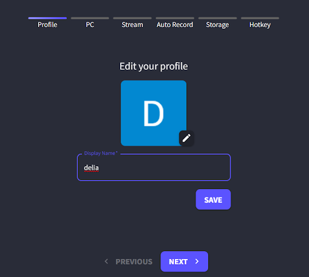
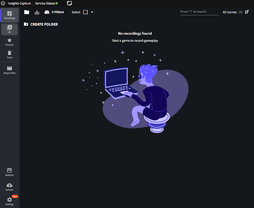
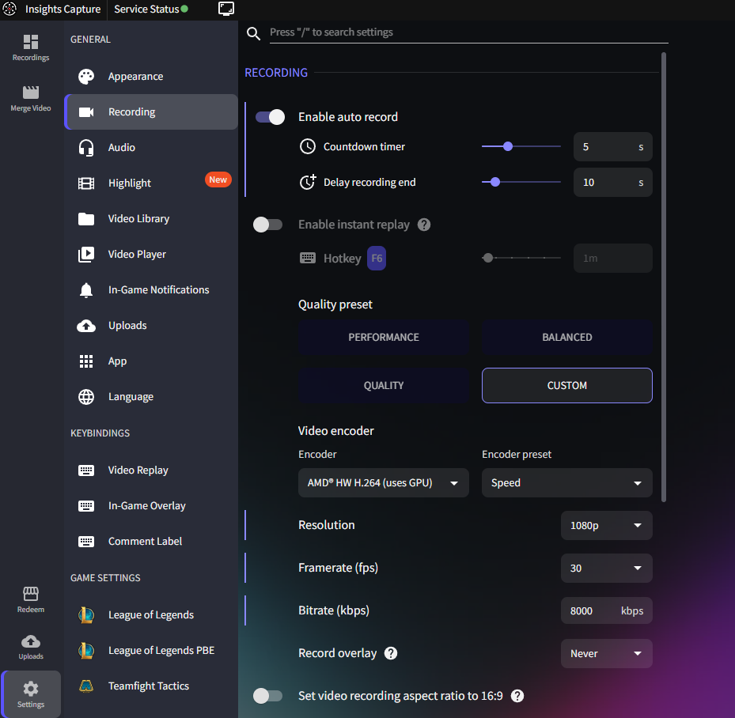
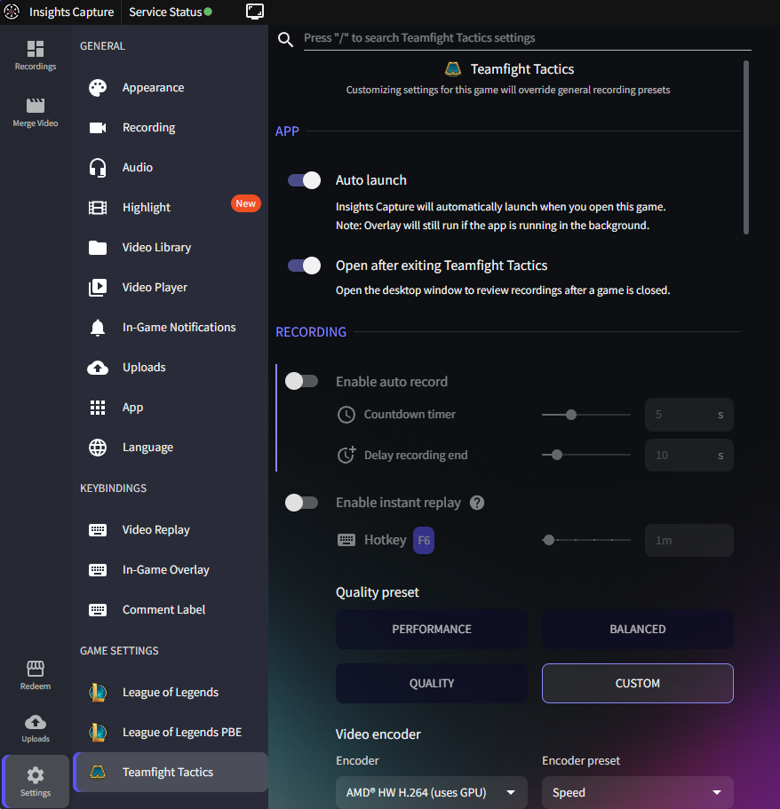
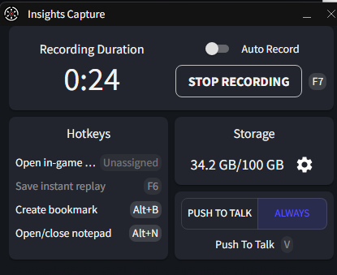
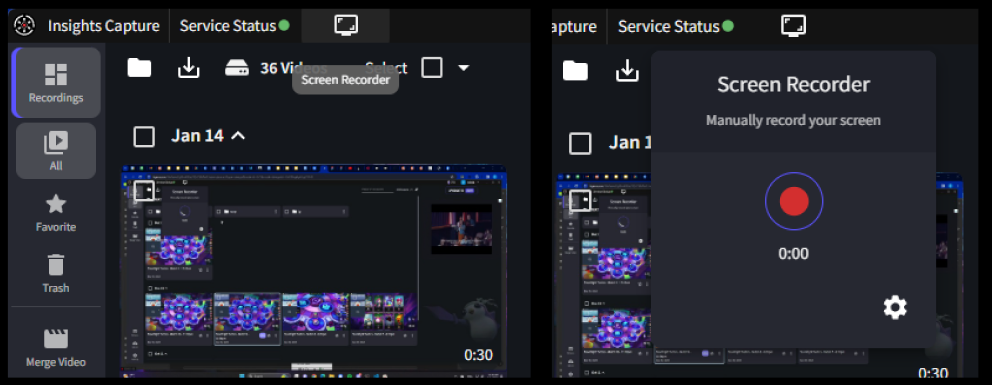

# An overview of features in Insights Capture, a screen recording software

Sometimes you want to show your friends a really neat trick that’s difficult to explain over text. Using Insights Capture, you can record your computer's screen with ease, make edits, and share your clips over social media such as discord and facebook.

In this feature overview, you will learn how to use the free features in Insights Capture to record your screen, edit videos, add comments, and share videos on social media. Let’s get started!

## What is Insights Capture?
Insights Capture is primarily used by the PC gaming community to record games, watch replays, and get feedback from peers and coaches. Insights Capture runs automatically on certain games that use Overwolf, a software that gathers in-game data to enhance the player experience. However, we can also benefit from the features Insights Capture has to offer in many contexts outside of gaming.

## Getting started with Insights Capture
You can download the app for Windows desktop at [Insights.gg](insights.gg).
It’s free, and you won’t need to create an account because you can use your email later.

Save the installer somewhere you’ll remember. Many users select `Downloads`.

Run the installer, click `Yes` to allow it to make changes to your computer, and then follow the instructions.

Once the installation is complete, click launch.

Sign in with your email and follow the last set of steps for setup.

Now you’re ready to go! You can start using the features below.

## Recording your screen
The primary feature of Insights Capture is recording your screen. While most users use this app to record their gaming sessions, you can also use Insights to take any screen recording outside of gaming.

### Method 1: Games supported by Overwolf
If Overwolf supports your game, you can use Insights Capture to record your game automatically. If you just want to record your screen or you want to record a game that is not integrated with Overwolf, check out [Method 2](./insights_capture.md#method-2-all-other-screen-recordings).

You can enable auto-recording in `Settings > Recording > Enable auto record`. When this is enabled, Insights Capture will automatically start recording when your Overwolf-supported game begins, and finish recording once your game has finished.

You can also turn off auto-record in settings and start recording in the overlay that shows up at the start of each game. You can adjust the settings for each specific game at `Settings > [Your game] > Auto launch`.

You can start and stop recordings using the in-game overlay.

### Method 2: All other screen recordings
Click on the Screen Recorder button at the top left of Insights Capture. In the dropdown, click the red button to begin recording. Click it again to stop recording.

## Editing videos
A nice feature of Insights Capture is that you can make simple edits to videos without having to download a separate video editing software. You can take short clips of a long video, or merge clips into a single video of highlights to share with your friends.

### Clipping videos
Click on the video you want to take a clip of. At the bottom left, click on `Clip`. You can also click on the Scissors icon in the top right corner.

This will bring up a yellow slider that you can resize or drag to cover the length of the clip you want to make.

Another way to clip is to type in the exact timestampe you want your clip to start and end, in the top right corner.

### Merging videos

## Leaving comments and notes on videos

## Importing and exporting videos to your file system

## Sharing videos on social media
