# An overview of features in Insights Capture, a screen recording software
{: .no_toc }

Sometimes you want to show your friends a really neat trick that’s difficult to explain over text. Using Insights Capture, you can record your computer's screen with ease, make edits, and share your clips over social media such as discord and facebook.

In this feature overview, you will learn how to use the free features in Insights Capture to record your screen, edit videos, add comments, and share videos on social media. Let’s get started!

---

  

    Table of contents
  

  {: .text-delta }
1. TOC
{:toc}

---

## What is Insights Capture?
Insights Capture is primarily used by the PC gaming community to record games, watch replays, and get feedback from peers and coaches. Insights Capture runs automatically on certain games that use Overwolf, a software that gathers in-game data to enhance the player experience. However, we can also benefit from the features Insights Capture has to offer in many contexts outside of gaming.

## Getting started with Insights Capture
1. You can download the app for Windows desktop at [Insights.gg](insights.gg).
It’s free, and you won’t need to create an account because you can use your email later.

2. Save the installer somewhere you’ll remember. Many users select `Downloads`.

3. Run the installer, click `Yes` to allow it to make changes to your computer, and then follow the instructions. Once the installation is complete, click launch.

4. Sign in with your email and follow the last set of steps for setup.

Now you’re ready to go! You can start using the features below.

## Recording your screen
The primary feature of Insights Capture is recording your screen. While most users use this app to record their gaming sessions, you can also use Insights to take any screen recording outside of gaming.

### Method 1: Games supported by Overwolf
If Overwolf supports your game, you can use Insights Capture to record your game automatically. If you just want to record your screen or you want to record a game that is not integrated with Overwolf, check out [Method 2](./insights_capture.md#method-2-all-other-screen-recordings).

You can enable auto-recording in `Settings > Recording > Enable auto record`. When this is enabled, Insights Capture will automatically start recording when your Overwolf-supported game begins, and finish recording once your game has finished.

You can also turn off auto-record in settings and start recording in the overlay that shows up at the start of each game. You can adjust the settings for each specific game at `Settings > [Your game] > Auto launch`.

You can start and stop recordings using the in-game overlay.

### Method 2: All other screen recordings
Click on the Screen Recorder button at the top left of Insights Capture. In the dropdown, click the red button to begin recording. Click it again to stop recording.

## Editing videos
A nice feature of Insights Capture is that you can make simple edits to videos without having to download a separate video editing software. You can take short clips of a long video, or merge several clips into a single video of highlights to share with your friends.

### Clipping videos
Click on the video you want to take a clip of. At the bottom left, click on `Clip`. You can also click on the Scissors icon in the top right corner.
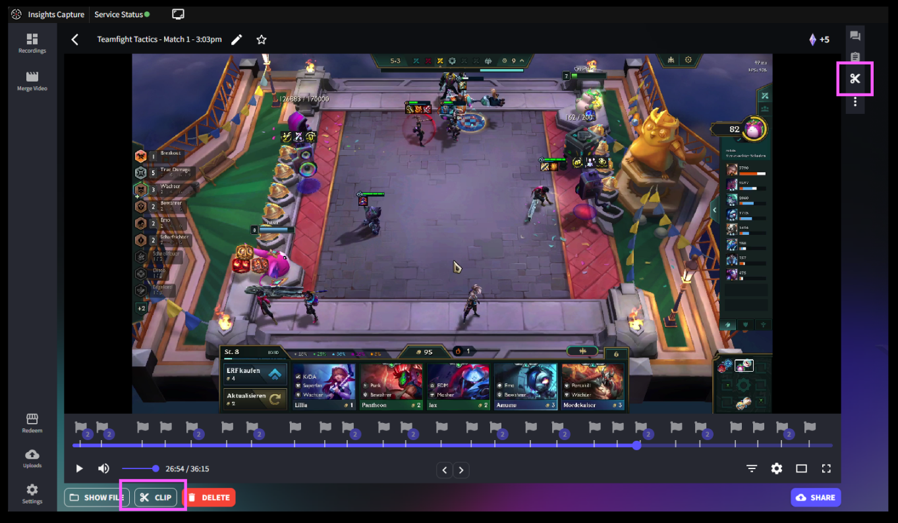

This will bring up a yellow slider that you can resize or drag to cover the length of the clip you want to make.

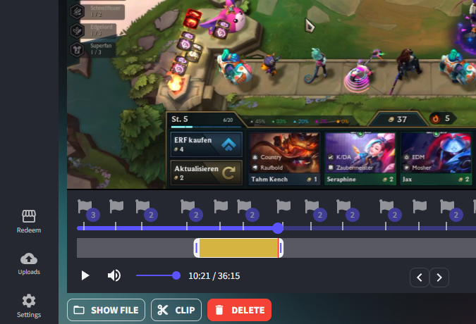

Another way to clip is to type in the exact timestamps you want your clip to start and end, in the top right corner.

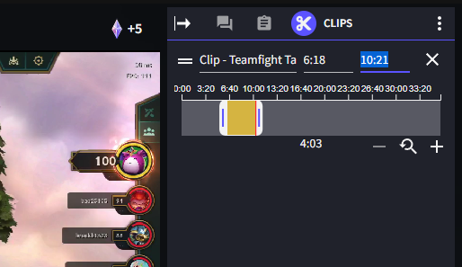

When you are finished clipping, click on `Save` in the bottom right and your clip will be saved as a new video in `Recordings`. You can also rename your videos to something descriptive so you'll remember each one.
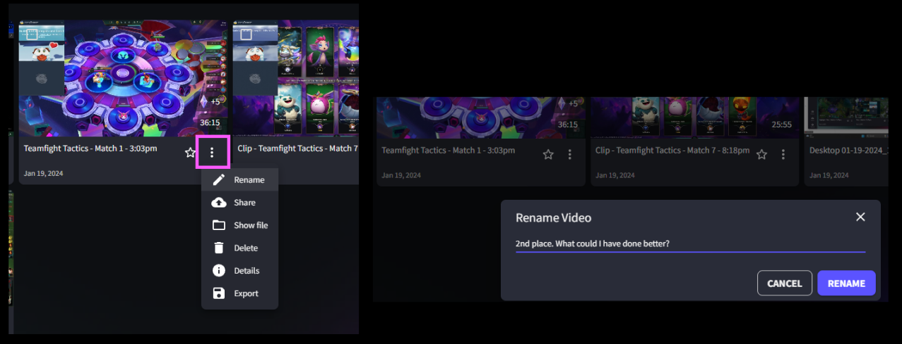

### Merging videos
If there are multiple clips you'd like to combine, click on `Merge Video` in the top left. Click on `Add Video` at the bottom to choose the clips you want to include and drag them to reposition their order. You can also use the `Search` feature in the top right to find any clips you know by name.
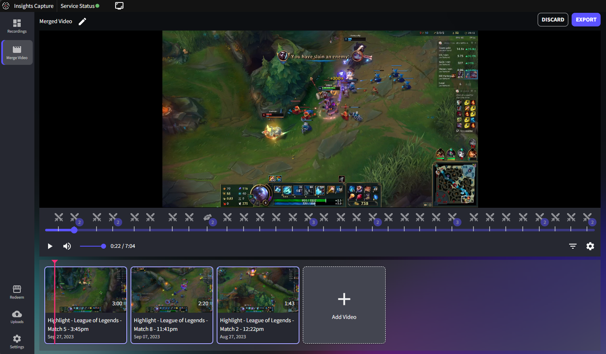

When you are done merging your clips, click on `Export` in the top right. Your new video will show up in `Recordings`.

## Leaving comments and notes on videos
You can leave comments and notes on videos for your own reference or for other Insights Capture users to review.

To leave a comment or a note, click on the video and click on the speech bubble or notepad icon in the top right corner.

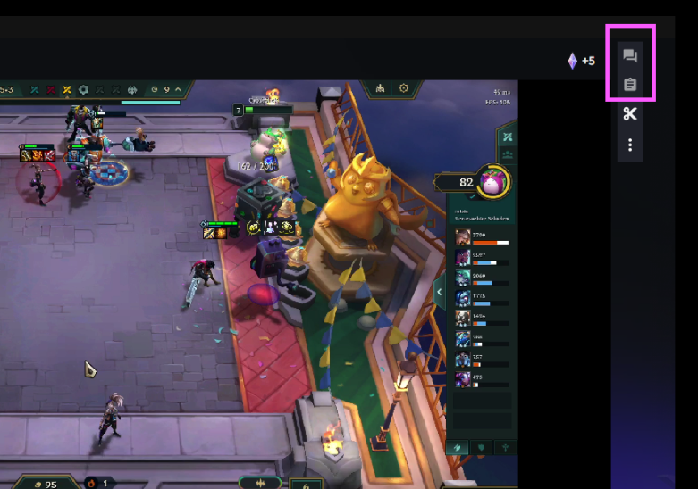

Drag the slider to the point in the video that you comment refers to. This will give your comment a helpful timestamp that you can click to jump to in the video. You can format your comment using the tools in the bottom right corner. After you've added a comment, you can also leave a reply. You can always go back and edit or delete you comment by clicking the three dots in the corner.
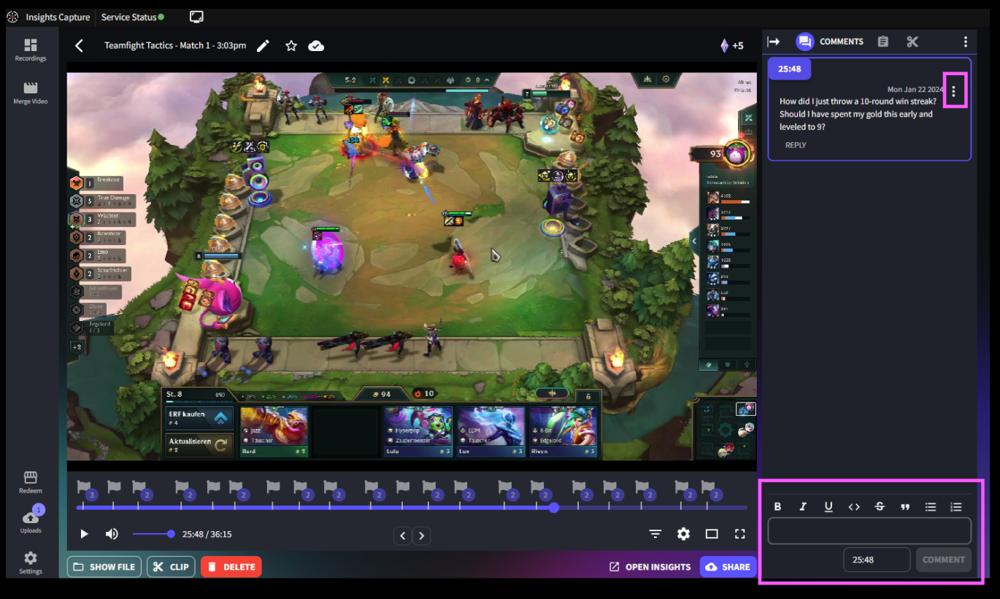

{: .note }
You can share comments you made with other Insights users. Check out how to upload your commented clips online at [sharing to Insights Capture](./insights_capture.md#sharing-to-insights-capture).

You can also leave notes to yourself by clicking the `Notepad` icon next to the comment icon.
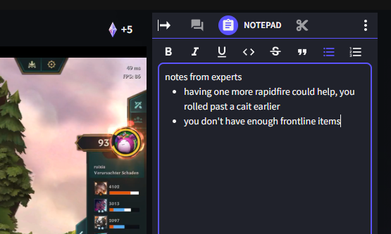

## Importing and exporting videos to your file system
You can reveal where a video was saved by clicking `Show File` at the bottom left.
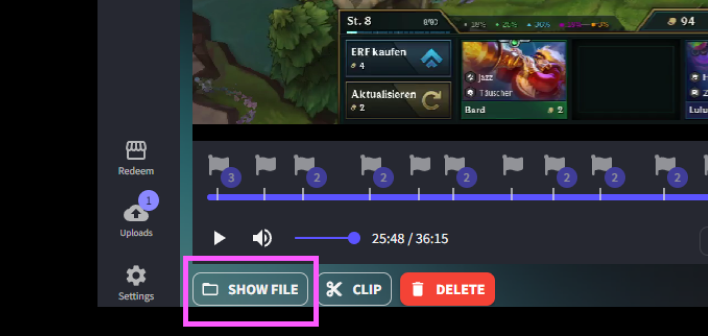

You can also import videos from your files into Insights Capture by clicking `Import Videos` in the top right.
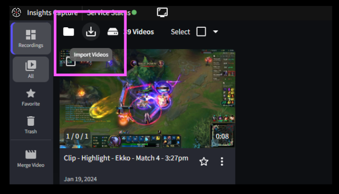

## Sharing videos on social media
Click the video you want to share and then click `Share` in the bottom right corner. You can share to Insights.gg, Discord, YouTube, or TikTok.
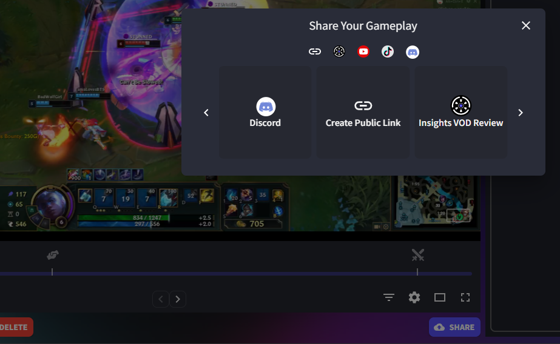

### Sharing to Insights.gg
If you're signed in, you can upload your video to Insights.gg by clicking `Share > Insights VOD Review`. The free plan gives you 5GB of space online to store your videos. Once you've shared, you can create teams or invite your friends by email.
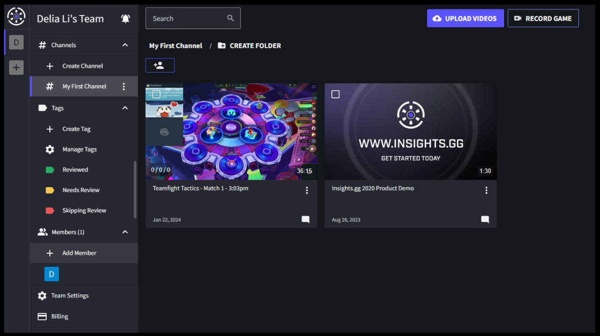
