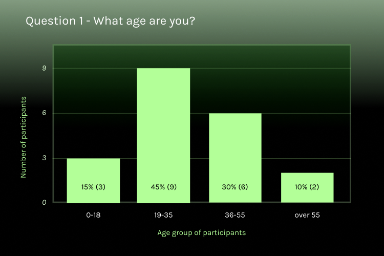
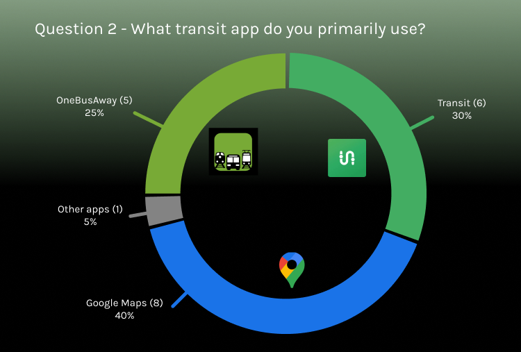
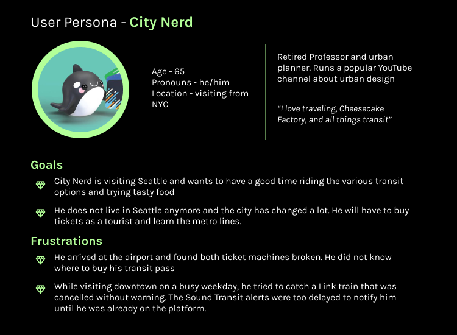
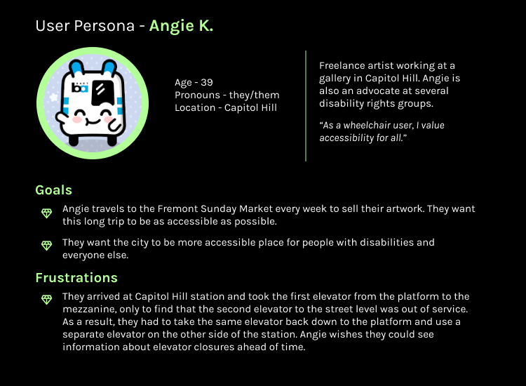
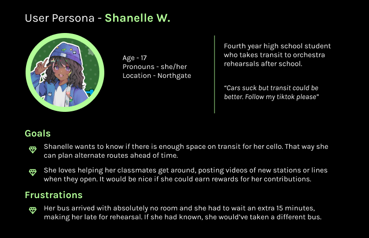

# Project Overview
{: .no_toc }

Welcome to Rate My Transit, or RMT, a mobile app that provides real time updates on travel conditions from the local transit community. The goal of Rate My Transit is to help transit users share information with each other and to make public transit more accessible and enjoyable for all riders.

  

    Table of contents
  

  {: .text-delta }
1. TOC
{:toc}

---

# Process
User-centric design approach

1. Identifying goals and solutions
2. Collecting user testimonies
3. Building the information architecture and site flow
4. Designing wireframes for core features
5. Designing wireframes for additional features
6. Building prototype
7. Iterating on feedback

# Problem Statement and proposed solutions
Transit riders face many challenges while using public transit and the apps that are currently available. These pain points include problems in existing apps and issues with transit in general, such as delays and reduced service.

* Existing apps have a number of issues: persistent lag and crashes in Transit app, out of date rider information in Google Maps, and poor visual accessibility and feature maintenance in OneBusAway.

* Official transit agency communications like Sound Transit and BART are too delayed to be useful. It is not helpful for riders to receive a text that trains will be cancelled after they are already waiting on the platform. [Source: Reddit](https://www.reddit.com/r/Seattle/comments/1ady2mz/wow_sound_transit_really_sht_the_bed_this_morning/)

* Riders with disabilities arrive at stations where elevators or wheelchair-accessible entrances are out of service. This also impacts riders without disabilities who are carrying luggage or bikes. [Source: Kiro News](https://www.kiro7.com/news/local/light-rail-riders-frustrated-by-broken-escalators-elevators-stations/6SJCGW4E5VB2LHPJKPOVMVC4LA/)

    

    _For northbound passengers, this means riding the train for at least an additional ten minutes to the next closest stop, getting off, and then taking a bus or a rideshare service. A text message like this one would also not be sufficient for southbound riders trying to plan ahead, because of how long it takes to reach Tukwila station from Rainier Beach station._

* Travelers visiting Seattle arrive at stations where the ticket machines are broken. Many tourists do not know where they can buy tickets or transit cards.

* Riders don't only want to see conditions on vehicles. They also want to see accurate updates on conditions at stations, before they arrive.

# User Research
Conducting user research involves two types of analysis: quantitative and qualitative research.

## Qualitative research

For quantitative research, 20 transit riders from Seattle responded to survey questions about transit apps.

## Quantitative research

For quantitative research, 4 transit riders from Seattle gave more detailed responses to questions about their experiences using transit apps.

### User Personas

# Competitive analysis with Google Maps, OBA, and Transit app

✅ - has feature

❌ - does not have feature

➖ - not applicable

|Features | Google Maps | OneBusAway | Transit | RMT|
|:--|:--:|:--:|:--:|:--:|
|Arrival times|✅|✅|✅|✅|
|Conditions on each vehicle|❌|❌|✅|✅|
|Conditions at the station|✅|❌|❌|✅|
|Users can type comments|✅|❌|❌|✅|
|Replies and upvotes|❌|❌|❌|✅|
|Ad-free|❌|✅|❌|✅|
|Rewards users for engagement|✅|➖|✅|✅|
|Meets accessibility standards|✅|❌|❌|✅|

# List of core features
* Map showing stations and the transit lines that pass through each station

* Users can post comments for stations and individual vehicles

* Users can add photos and helpful tags to comments

* Users can add replies, upvote other comments, and mark their own comments as resolved

# List of secondary features
* Sign in with email and an authentication code

* Signed-in users can customize their avatar

* Users can earn gems as a reward for engaging in the app

* Users can spend gems on cosmetics such as upgrading their avatar

# Wireframes

# Design System

# High Fidelity Prototype

# Thank you!

Thank you for reviewing my work! You can check out this project on [Behance](https://www.behance.net/gallery/191922921/RateMyTransit). Please connect with me on [LinkedIn](https://www.linkedin.com/in/delia-li-973659130/) or email me at delia.li96@gmail.com.
